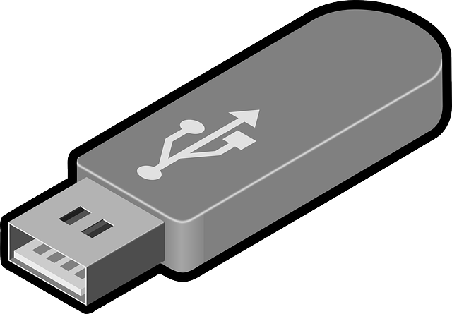

# Archivos
    

<p>
    <small>Created by
        <a href="https://t.me/rmarku" target="_blank">
            <i class="fab fa-telegram-plane"></i>rmarku
        </a>
    </small>
</p>


---

## ¿Qué son los archivos?

Los archivos son datos que se guardan en un medio
de almacenamiento no volatil. Esto quiere decir
que estos datos no se pierden cuando la PC queda 
sin energía


---

## ¿Qué son los archivos?

Esto nos permitirá recuperar la información
más adelante o transferirla a otra PC


---
## Organización de los archivos

Los archivos se identifican con un nombre.
Dependiendo del sistema de archivos del disco, 
este nombre puede estar formado de varias maneras.

En general, en los sistemas modernos se nombran como

### NOMBRE.extensión


---
## Organización de los archivos

Los archivos son agrupados en directorios y estos
directorios pueden estar contenidos en otros directorios.

A esto se le llama el árbol de directorios


---

## Rutas de archivos

La ruta de un archivo es la notación en forma de
 texto (string) que nos permite identificar a un archivo
 en un dispositivo de almacenamiento

Esta ruta depende del SO que estemos utilizando

#### Hay 2 formas de escribir las rutas

* **Absoluta**: Se escribe la ruta completa
* **Relativa**: Se escribe en relación donde estoy actualmente

---

## Rutas de archivos

#### Ruta Absoluta

Describe la ubicación completa del archivo, desde la unidad de origen
hasta el nombre y la extención. Se utiliza para ubicar al archivo desde cualquier
ubicación.

Ej Windows:
```shell script
c:\user\juan\documents\proyecto\main.cpp
```

Ej Linux:
```shell script
/home/juan/documents/proyecto/main.cpp
```

---

## Rutas de archivos

#### Ruta Relativa

Describe la ubicación del archivo, vista desde la ubicación actual.

Ej Windows:
```python
# c:\user\juan\documents\proyecto\main.cpp
# Estando en c:\user\juan\documents\otroproy\lib\
..\..\proyecto\main.cpp
```

Ej Linux:
```python
# /home/juan/documents/proyecto/main.cpp
# Estando en /home/juan/documents/otroproy/lib/
../../proyecto/main.cpp
```
---

## Rutas de archivos

#### Ruta Relativa

Se utilizan los siguientes directorios:

* **..** Indica el directorio anterior
* **.** Indica el directorio actual
---
## Uso de archivos en C++

Hasta ahora usamos io**stream** mediante **cin** **cout**

```c++
// para leer 
int a;
cin >> a;

// para escribir
int a = 5
cout << "Valor: " << a ;
```
---

## Usos de archivos en C++

#### Streams

* Un stream es un flujo de datos
* C++ posee varios stream para representar varios flujos de datos
* Cada stream sta asociado a una clase particular, con métodos específicos
para ese flujo de datos.

---

## Uso de archivos en C++

Para escribir/leer archivos, usaremos **fs**stream, o sus
derivados **of**stream e **if**stream

##### Distintas clases
 
* **fstream**: Se utiliza para leer y escribir
* **oftream**: Se utiliza para escribir
* **iftream**: Se utiliza para leer

---
## Uso de archivos en C++

#### Como trabajar con archivos.

1. Primero se debe crear el objeto que manejará el archivo
2. Conocer el nombre del archivo
3. Abrir el archivo 
4. Trabajar con el archivo
  * Leer datos del archivo
  * Escribir datos en el archivo
  * Leer y escribir el archivo
5. **Cerrar el archivo**
---

## Uso de archivos en C++

#### Como trabajar con archivos.

```cpp
#include <fstream>

int main(){
    ifstream inputFile;
    inputFile.open("archivo.txt"); // relativo a donde se ej el programa
// operaciones de lectura...
    inputFile.close()
    return 0;
}
```
---
## Uso de archivos en C++

|Método|Operación|
|------|---------|
|open()|Abre o crea un archivo|
|close()|Cierra un archivo ya creado|
|get()|Lee un solo carácter del archivo|
|put()|Escribe un solo carácter del archivo|
|read()|Lee datos del archivo|
|write()|Escribe datos del archivo|

---
## Uso de archivos en C++

|Modo|Significado|
|------|---------|
|ios::app|Modo agregar al final|
|ios::in|Modo lectura solamente|
|ios::out|Modo escritura solamente|
|ios::nocreate|Fallá si no existe el archivo|
|ios::trunc|Borra el contenido actual del archivo|
|OTROS|...|
---
## Uso de archivos en C++

```cpp
archivo.open("miArch.txt",ios::out|ios::nocreate); 
```
---
## Uso de archivos en C++

Podemos leer y escribir datos de 3 maneras:

* Utilizando los métodos get() y put()
* Utilizando operadores de stream ( << y >> )
* Utilizando los métodos write() y read()

---
## Uso de archivos en C++

#### get() y put()

Leen y escriben un único caracter

```cpp
char letra;
file.get(letra);
```
 
#### write() y read()

Leen y escriben un bloque de datos.

```cpp
char int;
file.read(&letra, sizeof(letra));
```

---
## Uso de archivos en C++

Manejo de Errores

|Método |Significado|
|-------|---------|
|eof()|Final del archivo|
|fail()|Falla al escribir, leer o abrir|
|bad()|Un error del que no se puede recuperar|
|good()|Ningún error ocurrió|

---
## A programar
