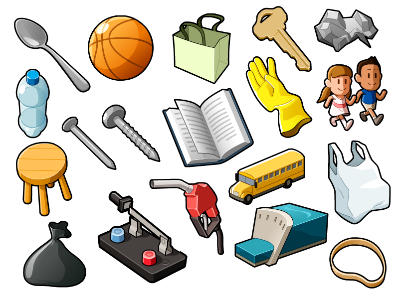
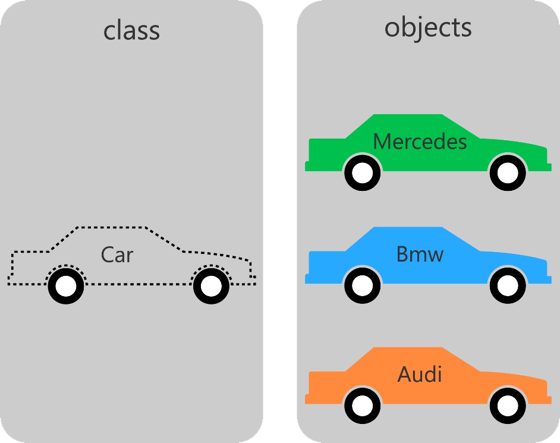

# Archivos
    

    <small>Created by
        <a href="https://t.me/rmarku" target="_blank">
            <i class="fab fa-telegram-plane"></i>rmarku
        </a>
    </small>

---

## ¿Qué son los archivos?

Los archivos son datos que se guardan en un medio
de almacenamiento no volatil. Esto quiere decir
que estos datos no se pierden cuando la PC queda 
sin energía

---

## ¿Qué son los archivos?

Esto nos permitirá recuperar la información
mas adelante o transferirla a otra PC

---
## Organización de los archivos

Los archivos se identifican con un nombre.
Dependiendo del sistema de archivos del disco, 
este nombre puede estar formado de varias maneras.

En general, en los sitemas modernos se nombran como

### NOMBRE.extencion

---
## Organización de los archivos

Los archivos son agrupados en directorios y estos
directorios pueden estar contenidos en otros directorios.

A esto se le llama el arbol de directorios

---

## Rutas de archivos

La ruta de un archivo es la notacion en forma de
 texto (string) que nos permite identificar a un archivo
 en un dispositivo de almacenamiento

Esta ruta depende del SO que estemos utilizando

#### Hay 2 formas de escribir las rutas

* **Absoluta**: Se escribe la ruta completa
* **Relativa**: Se escribe en relación donde estoy actualmente

---

## Caracteres

#### ASCII

<input type="text" maxlength="1" size="1" onkeyup="ascii(this)"
       style="height: 100px;font-size: 40px;width: 100px;text-align: center;">
➡️ 

Interpretación de binarios en símbolos gráficos

Hay distintos encoding, ASCII, UTF8, UTF16, ISO, etc...

Lo mas común es utilizar 8bits, pero hay encodings de 7, 10, 16, 32 bits...

El número binario 00100110, puede ser el número 38, el 0x26 o el simboló '&'

<aside class="notes">
</aside>

---

## Hardware y Softare

* La memoria de la PC es un conjunto de BITs</li>
* Los bits se agrupan de a BYTEs</li>
* Las computadoras tienen un conjunto de datos nativos</li>
* Los lenguajes de programación de alto nivel, ayudan a simplificar el uso de tipos de datos.</li>

<aside class="notes">
</aside>

---

## Tipo de Dato
    
* No es un dato, es lo que puede contener</li>
* Un tipo de dato es, en esencia, un espacio en memoria con restricciones.</li>
* Por ejemplo, el tipo "int" representa, generalmente, un conjunto de enteros de 32 bits cuyo rango va desde 
el -2.147.483.648 al 2.147.483.647
    </li>
* También se restringen las operaciones que se pueden realizar en ellos.</li>
* No confundirlos con Tipos de Datos Abstractos</li>

<aside class="notes">
</aside>

---

## Tipos de Datos Abstractos

<b>Abstracción:</b> consiste en tomar las cualidades o características que nos resulten mas relevantes de un
    objeto, con el fin de delimitar el analisis de este

➡️

<aside class="notes">
    La abstracción es una tecnica para centrarse en lo importante de un problema y solucionarlo mas facilmente.
    Ej, Mapas
</aside>

---
## Tipos de Datos Abstractos
    
* Los TDA son una abstracción de algún tipo de dato</li>
* Formalmente se trata de un modelo matemático para tipos de datos que están definidos por su comportamiento o semántica.
* Es un modelo matemático compuesto por una colección de operaciones definidas sobre un conjunto de datos para el modelo.
* A nivel usuario, se pueden ver el esquema de los datos y las operaciones para manipular los elementos que lo componen.

<aside class="notes">
</aside>

---

## Estructuras de datos

Las estructuras de datos son la implementación de un Tipo de dato abstracto.

<aside class="notes">
</aside>

---

## Introducción a la Programación Orientada a Objetos

Es un paradigma de porgramación que es muy cercano a como expresamríamos las cosas en la vida real.

---

## ¿Qué es una clase?

* Una clase es una plantilla para saber como crear Objetos</li>
* Una clase es un modelo que define un conjunto de <b>Atributos</b>(el estado) y <b>Métodos</b> para operar
con  el estado (el comportamiento)

* Los objetos se crean a partir de de las clases y se llaman <b>Instancias</b></li>
* Es una forma de abstraerse de los datos y sus operaciones y verlos como una "caja negra".</li>

---

## ¿Qué es una clase?

---
## Clases: Atributos o Variables miembros
    
* Son variables definidas dentro de la clase</li>
* Pueden ser <b>privadas</b> o <b>publicas</b></li>
* Definen el estado del objeto</li>
* Cada objeto tiene sus propios atributos</li>
    

---

## Clases: Métodos o Funciones miembros
    
* Son funciones que reciden dentro de la clase</li>
* Pueden ser <b>privadas</b> o <b>publicas</b></li>
* Comumente operan con los atributos del objeto</li>
* Permiten darle comportamiento al objeto</li>
    

---
## Objetos
    
* Son una instancia creada a partir de una clase.</li>
* Poseen <b>Identidad</b>, lo que los diferencia de otros objetos</li>
* Existe realmente en memoría.</li>
* Cada uno tiene sus propios atributos y sus metodos trabajan con estos atributos.</li>
    

---
## Clases: Sintaxis

<pre><code class="hljs c++" data-trim contenteditable spellcheck="false">
class Punto {
//por omisión los miembros son 'private' para que sólo
//se puedan modificar desde la propia clase.
private:
        // Variable miembro privada
        int x;
        int y;
public:
        // Constructor
        Punto();
        // Destructor
        ~Punto();
        // Funciones miembro o métodos
        int ObtenerX();
        int ObtenerY();
};
</code></pre>

---
## Constructor

Son unos métodos especiales que se ejecutan automáticamente al crear un objeto de la clase. En su declaración no se
especifica el tipo de dato que devuelven, y poseen el mismo nombre que la clase a la que pertenecen. Al igual que
otros métodos, puede haber varios constructores sobrecargados, aunque no pueden existir constructores virtuales.

---

## Destructor

Los destructores son funciones miembro especiales llamadas automáticamente en la ejecución del programa, y por tanto
no tienen por qué ser llamadas explícitamente por el programador.

Es llamado solo cuando la instancia del objeto termina, o cuando se realiza un <b>delete</b> del objeto.

---

## Destructor

Sus principales cometidos son:

* Liberar los recursos computacionales que el objeto de dicha clase haya adquirido en tiempo de ejecución al  expirar éste.

* Quitar los vínculos que pudiesen tener otros recursos u objetos con éste.

---

## Archivo .h

En el archivo .h se escribe el prototipo de la clase

<pre><code class="hljs c++" data-trim contenteditable spellcheck="false">
class Punto {
private:
        int x;
        int y;
public:
        Punto();
        ~Punto();
        int ObtenerX();
        int ObtenerY();
};
        </code></pre>

---

## Archivo .cpp

En el archivo .cpp se escribe la implementación de los metodos

<pre><code class="hljs c++" data-trim contenteditable spellcheck="false">
Punto::Punto(){
    x=0;
    y=0;
}
int Punto::ObtenerX(){
        return x;
}
int Punto::ObtenerY(){
        return y;
}
        </code></pre>

---

## Palabra clave <b>this</b>

Es un puntero que hace referencia al propio objeto. Es utilizado para poder acceder a los atributos de la
    instancia del objeto al cual pertenece el método

Comúnmente puede ser obviado su uso, ya que llamando directamente al atributo también podemos acceder

<pre><code class="hljs c++" data-trim contenteditable spellcheck="false">
int Punto::EscribirY(int val){
        y = val; // no hace falta utilizar this
}
int Punto::EscribirX(int x){
        this->x = x;
// Como x ahora es una variable dentro de la función, para acceder al atributo
// utilizo el puntero this
}
</code></pre>

---

### Diagrama de clase (UML)

Es un diagrama utilizado para mostrar rapidamente que posee una clase
<table style="
  border-collapse: collapse;border: solid 4px; border-radius:4px; font-size: 0.8em">
        <thead>
        <tr><th>Nombre de Clase</th></tr>
        </thead>
        <tbody>
        <tr><td style="border:none;border-top: solid 4px">-atributo1: tipo</td></tr>
        <tr><td style="border:none;">-atributo2: tipo</td></tr>
        <tr><td style="border:none">-atributo3: tipo</td></tr>
        <tr><td style="border:none;border-top: solid 4px">+metodo1(param: tipo):tipo retorno</td></tr>
        <tr><td style="border:none">+metodo2(param: tipo):tipo retorno</td></tr>
        <tr><td style="border:none">+metodo3(param: tipo):tipo retorno</td></tr>
        <tr><td style="border:none">+metodo4(param: tipo):tipo retorno</td></tr>
        </tbody>
    </table>

---
# A programar
