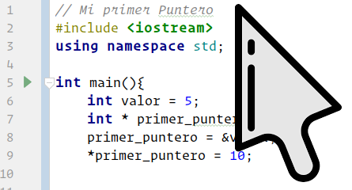

# Informática II
<p>
    <small>Created by
        <a href="https://t.me/rmarku" target="_blank">
            <i class="fab fa-telegram-plane"></i>rmarku
        </a>
    </small>
</p>

---

# Punteros

---

## Memoria de Una PC


---

## Memoria de Una PC

<table>
    <thead>
    <tr>
        <th><span style="color:#19d713">Address</span></th>
        <th><span style="color:#19d713">Data</span></th>
    </tr>
    </thead>
    <tbody>
    <tr>
        <td><span style="color:#ec6161">0x325487</span></td>
        <td><span style="color:#fccb20">0101101001</span></td>
    </tr>
    <tr>
        <td><span style="color:#ec6161">0x325488</span></td>
        <td><span style="color:#fccb20">254</span></td>
    </tr>
    <tr>
        <td><span style="color:#ec6161">0x325489</span></td>
        <td><span style="color:#fccb20">0x32</span></td>
    </tr>
    <tr>
        <td><span style="color:#ec6161">0x32548A</span></td>
        <td><span style="color:#fccb20">0xC2</span></td>
    </tr>
    <tr>
        <td><span style="color:#ec6161">0x32548B</span></td>
        <td><span style="color:#fccb20">'a'</span></td>
    </tr>
    <tr>
        <td><span style="color:#ec6161">0x32548C</span></td>
        <td><span style="color:#fccb20">0</span></td>
    </tr>
    <tr>
        <td><span style="color:#ec6161">0x32548D</span></td>
        <td><span style="color:#fccb20">'e'</span></td>
    </tr>
    </tbody>
</table>

---

## El Puntero o apuntador

Los punteros son variables cuyos valores son direcciones de memoria.<br>



---

## Punteros

* Una <b style="color:yellow">variable</b> contiene un valor especifico
* El <b style="color:yellow">puntero</b> contiene la dirección de una variable que contiene un valor especifico.
* Las variables hacen referencia <i style="color:yellow">directa</i> a un valor.
* Los punteros hacen referencia <i style="color:yellow">indirecta</i> a un valor.


---
### Sintaxis de declaración

```cpp
int *miPuntero;
```
---
### Operador dirección
El operador dirección (<b style="color:yellow">&</b>) es un operador unario que obtiene la dirección de memoria de su operando.

```cpp
int i = 5;
int *iPtr = &i;
```
---
### Operador de Indirección
El operador de Indirección (<b style="color:yellow">*</b>) es un operador unario obtiene
el valor del lugar donde está apuntando un puntero.

```cpp
int i = 5;
int *iPtr;
iPtr= &i;
cout << *iPtr;
```
---
### ejemplo de uso:

```cpp
#include <iostream>

int main(){
    int *miPuntero;
    int num = 5;

    cout << num << endl;
    cout << &num << endl;

    miPuntero = &num ;

    cout << miPuntero << endl;
    cout << *miPuntero << endl;

    return 0;
}
```

---
### ejemplo de uso:
<table>
    <tr>
        <td>
            Memoria
            <table style="font-size: 0.45em">
                <thead>
                <tr>
                    <th>Nombre</th>
                    <th>Direc</th>
                    <th>Dato</th>
                </tr>
                </thead>
                <tbody>
                <tr>
                    <td><span class="fragment fade-in" data-fragment-index="1">
                        <span class="fragment  highlight-current-green" data-fragment-index="1">
                        *miPuntero
                        </span></span>
                    </td>
                    <td>0x325485</td>
                    <td>
                        <div style="position:relative; margin-top:-12px" >
                            <span class="fragment fade-out" data-fragment-index="9" style="position: absolute">0x3210</span>
                            <span class="fragment  fade-in" data-fragment-index="9" style="position: absolute">
                            <span class="fragment  highlight-current-green" data-fragment-index="9">
                            <span class="fragment  highlight-current-blue" data-fragment-index="11">
                            <span class="fragment  highlight-current-red" data-fragment-index="13">
                            0x325486
                            </span></span></span></span>
                        </div>
                    </td>
                </tr>
                <tr>
                    <td><span class="fragment fade-in" data-fragment-index="3">
                        <span class="fragment  highlight-current-green" data-fragment-index="3">
                        num
                        </span></span>
                    </td>
                    <td>
                        <span class="fragment  highlight-current-blue" data-fragment-index="7">
                        <span class="fragment  highlight-current-blue" data-fragment-index="9">
                        <span class="fragment  highlight-current-red" data-fragment-index="13">
                        0x325486
                        </span></span></span>
                    </td>
                    <td>
                        <div style="position:relative; margin-top:-12px" >
                            <span class="fragment fade-out" data-fragment-index="3" style="position: absolute">0x3210</span>
                            <span class="fragment  fade-in" data-fragment-index="3" style="position: absolute">
                            <span class="fragment  highlight-current-green" data-fragment-index="3">
                            <span class="fragment  highlight-current-blue" data-fragment-index="5">
                            <span class="fragment  highlight-current-blue" data-fragment-index="13">
                            5
                            </span></span></span></span>
                        </div>
                    </td>
                </tr>
                <tr>
                    <td></td>
                    <td>0x325487</td>
                    <td>0x3210</td>
                </tr>
                <tr>
                    <td></td>
                    <td>0x325488</td>
                    <td>0x3210</td>
                </tr>
                <tr>
                    <td></td>
                    <td>0x325489</td>
                    <td>0x3210</td>
                </tr>
                <tr>
                    <td></td>
                    <td>0x32548A</td>
                    <td>0x3210</td>
                </tr>
                <tr>
                    <td></td>
                    <td>0x32548B</td>
                    <td>0x3210</td>
                </tr>
                <tr>
                    <td></td>
                    <td>0x32548C</td>
                    <td>0x3210</td>
                </tr>
                <tr>
                    <td></td>
                    <td>0x32548D</td>
                    <td>0x3210</td>
                </tr>
                <tr>
                    <td></td>
                    <td>0x32548E</td>
                    <td>0x3210</td>
                </tr>
                </tbody>
            </table>
        </td>
        <td width="65%">
<div><pre style="background: #262626">
<span class="hljs-meta">#<span class="hljs-meta-keyword">include</span> <span class="hljs-meta-string">&lt;iostream&gt;</span></span>
<span class="fragment  fade-out" data-fragment-index="0">🟥</span><span class="hljs-function"><span class="hljs-keyword">int</span> <span class="hljs-title">main</span><span class="hljs-params">()</span></span>{
<span class="fragment  fade-in" data-fragment-index="0"><span class="fragment  fade-out" data-fragment-index="2">🟥</span></span>        <span class="hljs-keyword">int</span> *miPuntero;
<span class="fragment  fade-in" data-fragment-index="2"><span class="fragment  fade-out" data-fragment-index="4">🟥</span></span>        <span class="hljs-keyword">int</span> num = <span class="hljs-number">5</span>;<br>
<span class="fragment  fade-in" data-fragment-index="4"><span class="fragment  fade-out" data-fragment-index="6">🟥</span></span>        <span class="hljs-built_in">cout</span> &lt;&lt; num &lt;&lt; <span class="hljs-built_in">endl</span>;
<span class="fragment  fade-in" data-fragment-index="6"><span class="fragment  fade-out" data-fragment-index="8">🟥</span></span>        <span class="hljs-built_in">cout</span> &lt;&lt; &amp;num &lt;&lt; <span class="hljs-built_in">endl</span>;<br>
<span class="fragment  fade-in" data-fragment-index="8"><span class="fragment  fade-out" data-fragment-index="10">🟥</span></span>        miPuntero = &amp;num ;<br>
<span class="fragment  fade-in" data-fragment-index="10"><span class="fragment  fade-out" data-fragment-index="12">🟥</span></span>        <span class="hljs-built_in">cout</span> &lt;&lt; miPuntero &lt;&lt; <span class="hljs-built_in">endl</span>;
<span class="fragment  fade-in" data-fragment-index="12"><span class="fragment  fade-out" data-fragment-index="14">🟥</span></span>        <span class="hljs-built_in">cout</span> &lt;&lt; *miPuntero &lt;&lt; <span class="hljs-built_in">endl</span>;
<span class="fragment  fade-in" data-fragment-index="14"><span class="fragment  fade-out" data-fragment-index="15">🟥</span></span>        <span class="hljs-keyword">return</span> <span class="hljs-number">0</span>;
    }</pre></div>
        </td>
    </tr>
</table>

<div style="font-size: 0.6em; background: #1c1e20; text-align: left">
    <span class="fragment  fade-in" data-fragment-index="5">
    <span class="fragment  highlight-current-green" data-fragment-index="5">5</span></span><br>
    <span class="fragment  fade-in" data-fragment-index="7">
    <span class="fragment  highlight-current-green" data-fragment-index="7">0x325486</span></span><br>
    <span class="fragment  fade-in" data-fragment-index="11">
    <span class="fragment  highlight-current-green" data-fragment-index="11">0x325486</span></span><br>
    <span class="fragment  fade-in" data-fragment-index="13">
    <span class="fragment  highlight-current-green" data-fragment-index="13">5</span></span><br>
</div>

---

## ¿Porque C++ usa punteros?

* Al usar punteros se puede utilizar memoria dinámica
* Son más eficientes para utilizar arreglos y estructuras
* Se pueden hacer punteros a funciones
* Produce código eficiente y compacto
* Son una herramienta muy potente.

---

## Desventajas

* Punteros mal inicializados pueden causar SegFault.
* Si su valor es erroneo, puede llevar a corrupción de memoria.

---

## Resumen:

* Un * en la declaración de una variable antes del nombre, define un puntero.
* Un & antes de una variable indica la dirección de memoria de dicha variable.
* Un * antes de un puntero, indica que estoy desrreferenciandolo y obteniendo el valor de donde apunta.

---

## Punteros y Arreglos

El nombre del arreglo es un puntero que apunta al primer elemento
del arreglo.

<p style="color: yellow; font-size: 1.8em">
    arr == &arr[0]
</p>


---

## Punteros y Arreglos

Cuando usamos arreglos, estamos usando punteros indirectamente, ya que es una notación
que se utiliza de manera similar.

```cpp

int arr[3]{ 1, 2, 3 };  // arr == &arr[0]

cout << arr[0] << " = " << *arr << endl;

cout << arr[1] << " = " << *(arr + 1) << endl;

cout << arr[2] << " = " << *(arr + 2) << endl;
...

```

---

## Punteros y funciones

Los punteros pueden ser pasados como argumentos a funciones, y estaremos pasando
la dirección de memoria de la variable original.

```cpp
int miFuncion( int a, int *b, int &c);
```

---
   
## Punteros y funciones

```cpp
int miFuncion( int a, int *b, int &c);
```

En este código, las 3 variables se están pasando de manera distinta.

* **a** se está pasando por copia
* **b** se esta pasando por puntero
* **c** se esta pasando por referencia

---
### ejemplo de uso:

```cpp
#include <iostream>

int miFuncion( int a, int *b, int &c){
    a++;
    return a + *b + c;
}

int main(){
    int x = 2;
    int y = 4;
    int z = 6;

    cout << miFuncion(x, &y, z) << endl;
    cout << &num << endl;

    miPuntero = &num ;

    cout << miPuntero << endl;
    cout << *miPuntero << endl;

    return 0;
}
```

---
### ejemplo de uso:
<table>
    <tr>
        <td>
            Memoria
            <table style="font-size: 0.45em">
                <thead>
                <tr>
                    <th>Nombre</th>
                    <th>Direc</th>
                    <th>Dato</th>
                </tr>
                </thead>
                <tbody>
                <tr>
                    <td><span class="fragment fade-in" data-fragment-index="1">
                        <span class="fragment  highlight-current-green" data-fragment-index="1">
                        *miPuntero
                        </span></span>
                    </td>
                    <td>0x325485</td>
                    <td>
                        <div style="position:relative; margin-top:-12px" >
                            <span class="fragment fade-out" data-fragment-index="9" style="position: absolute">0x3210</span>
                            <span class="fragment  fade-in" data-fragment-index="9" style="position: absolute">
                            <span class="fragment  highlight-current-green" data-fragment-index="9">
                            <span class="fragment  highlight-current-blue" data-fragment-index="11">
                            <span class="fragment  highlight-current-red" data-fragment-index="13">
                            0x325486
                            </span></span></span></span>
                        </div>
                    </td>
                </tr>
                <tr>
                    <td><span class="fragment fade-in" data-fragment-index="3">
                        <span class="fragment  highlight-current-green" data-fragment-index="3">
                        num
                        </span></span>
                    </td>
                    <td>
                        <span class="fragment  highlight-current-blue" data-fragment-index="7">
                        <span class="fragment  highlight-current-blue" data-fragment-index="9">
                        <span class="fragment  highlight-current-red" data-fragment-index="13">
                        0x325486
                        </span></span></span>
                    </td>
                    <td>
                        <div style="position:relative; margin-top:-12px" >
                            <span class="fragment fade-out" data-fragment-index="3" style="position: absolute">0x3210</span>
                            <span class="fragment  fade-in" data-fragment-index="3" style="position: absolute">
                            <span class="fragment  highlight-current-green" data-fragment-index="3">
                            <span class="fragment  highlight-current-blue" data-fragment-index="5">
                            <span class="fragment  highlight-current-blue" data-fragment-index="13">
                            5
                            </span></span></span></span>
                        </div>
                    </td>
                </tr>
                <tr>
                    <td></td>
                    <td>0x325487</td>
                    <td>0x3210</td>
                </tr>
                <tr>
                    <td></td>
                    <td>0x325488</td>
                    <td>0x3210</td>
                </tr>
                <tr>
                    <td></td>
                    <td>0x325489</td>
                    <td>0x3210</td>
                </tr>
                <tr>
                    <td></td>
                    <td>0x32548A</td>
                    <td>0x3210</td>
                </tr>
                <tr>
                    <td></td>
                    <td>0x32548B</td>
                    <td>0x3210</td>
                </tr>
                <tr>
                    <td></td>
                    <td>0x32548C</td>
                    <td>0x3210</td>
                </tr>
                <tr>
                    <td></td>
                    <td>0x32548D</td>
                    <td>0x3210</td>
                </tr>
                <tr>
                    <td></td>
                    <td>0x32548E</td>
                    <td>0x3210</td>
                </tr>
                </tbody>
            </table>
        </td>
        <td width="65%">
<div><pre style="background: #262626">
<span class="hljs-meta">#<span class="hljs-meta-keyword">include</span> <span class="hljs-meta-string">&lt;iostream&gt;</span></span>
<span class="fragment  fade-out" data-fragment-index="0">🟥</span><span class="hljs-function"><span class="hljs-keyword">int</span> <span class="hljs-title">main</span><span class="hljs-params">()</span></span>{
<span class="fragment  fade-in" data-fragment-index="0"><span class="fragment  fade-out" data-fragment-index="2">🟥</span></span>        <span class="hljs-keyword">int</span> *miPuntero;
<span class="fragment  fade-in" data-fragment-index="2"><span class="fragment  fade-out" data-fragment-index="4">🟥</span></span>        <span class="hljs-keyword">int</span> num = <span class="hljs-number">5</span>;<br>
<span class="fragment  fade-in" data-fragment-index="4"><span class="fragment  fade-out" data-fragment-index="6">🟥</span></span>        <span class="hljs-built_in">cout</span> &lt;&lt; num &lt;&lt; <span class="hljs-built_in">endl</span>;
<span class="fragment  fade-in" data-fragment-index="6"><span class="fragment  fade-out" data-fragment-index="8">🟥</span></span>        <span class="hljs-built_in">cout</span> &lt;&lt; &amp;num &lt;&lt; <span class="hljs-built_in">endl</span>;<br>
<span class="fragment  fade-in" data-fragment-index="8"><span class="fragment  fade-out" data-fragment-index="10">🟥</span></span>        miPuntero = &amp;num ;<br>
<span class="fragment  fade-in" data-fragment-index="10"><span class="fragment  fade-out" data-fragment-index="12">🟥</span></span>        <span class="hljs-built_in">cout</span> &lt;&lt; miPuntero &lt;&lt; <span class="hljs-built_in">endl</span>;
<span class="fragment  fade-in" data-fragment-index="12"><span class="fragment  fade-out" data-fragment-index="14">🟥</span></span>        <span class="hljs-built_in">cout</span> &lt;&lt; *miPuntero &lt;&lt; <span class="hljs-built_in">endl</span>;
<span class="fragment  fade-in" data-fragment-index="14"><span class="fragment  fade-out" data-fragment-index="15">🟥</span></span>        <span class="hljs-keyword">return</span> <span class="hljs-number">0</span>;
    }</pre></div>
        </td>
    </tr>
</table>

<div style="font-size: 0.6em; background: #1c1e20; text-align: left">
    <span class="fragment  fade-in" data-fragment-index="5">
    <span class="fragment  highlight-current-green" data-fragment-index="5">5</span></span><br>
    <span class="fragment  fade-in" data-fragment-index="7">
    <span class="fragment  highlight-current-green" data-fragment-index="7">0x325486</span></span><br>
    <span class="fragment  fade-in" data-fragment-index="11">
    <span class="fragment  highlight-current-green" data-fragment-index="11">0x325486</span></span><br>
    <span class="fragment  fade-in" data-fragment-index="13">
    <span class="fragment  highlight-current-green" data-fragment-index="13">5</span></span><br>
</div>

---
