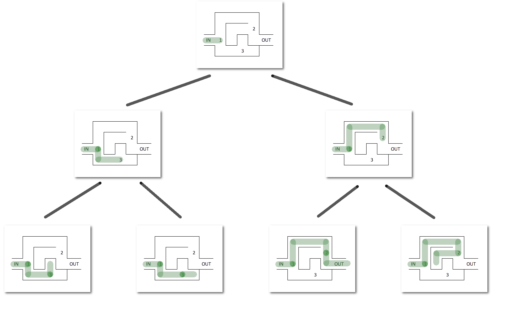

# Recursividad
    

<p>
    <small>Created by
        <a href="https://t.me/rmarku" target="_blank">
            <i class="fab fa-telegram-plane"></i>rmarku
        </a>
    </small>
</p>


---
## 쯈u칠 es la recursividad?
<a target="_blank" href="http://www.google.com/search?q=recursividad">Google -> Recursividad</a>

---
## 쯈u칠 es la recursividad?


---
## Recursividad

Es la forma de especificar un proceso basado en su propia definición.

Un algoritmo recursivo es un algoritmo que expresa la solución de un 
problema en terminos de una llamada a si mismo. La llamada a si mismo 
se conoce como llamada recursiva


---
## La recursividad es esto:
```cpp
    int funcion(){
        funcion();
    }
```
Una función que se llama a si misma.

---
## 쯇or que una función se llamaría a si misma?

Porque es recursiva, 🤣

* **Recursividad**:

  Cualidad de recursivo.
    
* **Recursivo**:

  Que puede repetirse o aplicarse indefinidamente.
    
---
### Ejemplo
## Factorial

# n!

Plantiemos una solución.

---
### Ejemplo: Factorial

## 5! = 5 * 4 * 3 * 2 * 1 
## 5! = 5 *(4 * 3 * 2 * 1)
## 4! = 4 * 3 * 2 * 1
## 5! = 5 * 4!

---
## Ejemplo: Factorial
# N! = N * (N-1)!

---
## Ejemplo: Factorial
#### 쮽acil no?<br>
Hay solo un problema

## 2! = 2 * 1!
## 1! = 1 * 0!
## 0! = 0 * -1!
쮺uando paro?

---
## Ejemplo: Factorial
## Fijo lo siguiente
## 0! = 1

---
## Ejemplo: Factorial

## 5! = 5 * 3! = 120
## 4! = 4 * 3! = 24
## 3! = 3 * 2! = 6
## 2! = 2 * 1! = 2
## 1! = 1 

---
## Recursividad

* Es un concepto utilizado en matemática y computación
* Se utiliza para dar soluciones elegantes a problemas complejos
* Es una alternativa a los bucles de repetición

---
## Función recursiva

* La función recursiva sabe como resolver el o los casos más simples y un caso base.
* Si se llama a la función con el caso base, esta simplemente devuelve un resultado
* Si se llama sin el caso base, la función divide el problema en:
    * Una parte que sabe resolver
    * Una parte que no sabe resolver, pero es similar al problema inicial.
    
---
## Función recursiva
* Como este problema se parece al problema original, la función llama a una copia de si misma
para que resuelva el problema. (llamada recursiva)

---
## Funciones recursivas

Las funciones recursivas tienen dos partes:

* El caso **Recursivo**, que soluciona parte del problema y hace la llamada recursiva.
* El caso **Base**, el que no hace llamada recursiva.

Una función recursiva puede tener uno o más casos bases y una o más llamadas recursivas.

---
## Funciones recursivas
### Cuidados al usar recursividad

* La recursión es poco intuitiva
* No hacer cosas recursivas si se puede hacer iterativa
* Algunas veces, la solución recursiva es la solución más elegante y entendible.

---
## Funciones recursivas
### Depurar recursividades

* La recursion es difícil de depurar
* Si el caso base esta mal definido, probablemente produzca un Stack Overflow
* Comúnmente, la función recursiva no funciona o funciona completamente.

---
## Funciones recursivas
### Como realizarlas

* No comenzar directamente con el código, garabatear y ver si uno entiende el proceso
* Comenzar con el caso Recursivo
* Agregar el caso Base.
* Comúnmente, si estas "Hardcodeando" muchos casos bases, la estás complicando

---
## Funciones recursivas
### Como pensar el caso Recursivo

* Piensa en como dividirlo en un subproblema y hacerlo más pequeño
* Piensa como achicar el problema y hacerlo más simple (N-1?, N/2?, ...)
* Piensa en la recursividad como hacer trampa

---
## Funciones recursivas
### Como pensar el caso Base

* Piensa en cual sería el problema más simple
* Piensa cual sería la solución directa de este subproblema
* Asegurate que la recursion converge al caso base

---
### Ejemplo Potencia

## 2<sup>4</sup> =2 * 2 * 2 * 2 
## 2<sup>4</sup> = 2 * ( 2 * 2 * 2 ) 
## 2<sup>4</sup> = 2 x 2<sup>3</sup>

---
### Ejemplo Potencia

```cpp
#include &lt;iostream&gt;

unsigned long long potencia(unsigned int base, unsigned int exp){
    if(exp == 0){
        return 1;
    }
    return base * potencia( base, exp - 1 );
}

int main(){
    cout << "2 a la 0:  " << potencia(2,0)  << endl;
    cout << "2 a la 4:  " << potencia(2,4)  << endl;
    cout << "2 a la 8:  " << potencia(2,8)  << endl;
    cout << "2 a la 16: " << potencia(2,16) << endl;
    cout << "2 a la 32: " << potencia(2,32) << endl;
    return 0;
}
```

---
### Ejemplo Fibonacci

`\[
f(n) =
\Bigg\{ \begin{matrix}
0 & n = 0 \\
1 & n = 1 \\
f(n-1)+f(n-2) & n > 0 \\
\end{matrix}
\]`


---
### Ejemplo Fibonacci

```cpp
#include &lt;iostream&gt;

unsigned long fibonacci(unsigned n){
    if( n == 0 || n == 1)
        return n;

    return fibonacci(n-1) + fibonacci(n-2);
}

int main(){
    cout << "fib: 3  " << fibonacci(3)  << endl;
    cout << "fib: 5  " << fibonacci(5)  << endl;
    cout << "fib: 10  " << fibonacci(10) << endl;
    cout << "fib: 15  " << fibonacci(15) << endl;
    return 0;
}
```
    
---

## Backtracking o Vuelta atrás

Es una metodología para encontrar soluciones que nos permite
probar diferentes caminos y volver si no es el correcto.
 
---

## Backtracking o Vuelta atrás

---

# Ejemplo Laberinto ...
