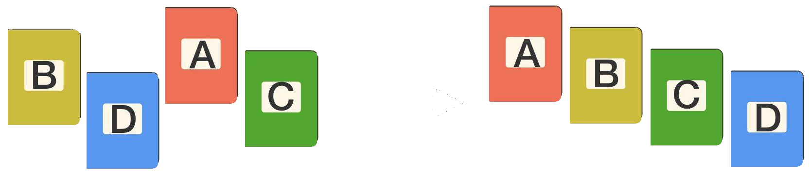

# Ordenamiento QuickSort
    
<small>Created by
    <a href="https://t.me/rmarku" target="_blank">
        <i class="fab fa-telegram-plane"></i>rmarku
    </a>
</small>

---
## Ordenamiento


<aside class="notes">
    Impacto en la vida diaraia<br>
    Ejemplo Guia telefónica desordenada<br>
    Relación busqueda y ordenamiento<br>
</aside>

---
## Metodo Quicksort

<p>Sea un Arreglo y Largo el número de elementos del arreglo
    que debe ser ordenado. Elegir un elemento A de una
    posición específica en el arreglo (ej. A = Arreglo[0]).
    Suponiendo que A está en la posición j entonces:</p>

* Cada uno de los elementos en las posiciones de 0 a j-1 es 1 es menor o igual que A
        
* Cada uno de los elementos en las posiciones j+1 a n-1 es 1 es mayor o igual que A
        


---
## Ejemplo

<p>Datos del arreglo</p>
<table>
    <tr class="dato-qs">
        <td></td>
        <td></td>
        <td></td>
        <td></td>
        <td></td>
        <td></td>
    </tr>
    <tr class="dato-qs">
        <td>4</td>
        <td>5</td>
        <td>2</td>
        <td>3</td>
        <td>6</td>
        <td>1</td>
    </tr>
</table>

---
## Ejemplo

<p>Elegimos el pivote</p>
<table>
    <tr class="desc-qs">
        <td>Piv</td>
        <td></td>
        <td></td>
        <td></td>
        <td></td>
        <td></td>
    </tr>
    <tr class="dato-qs">
        <td>4</td>
        <td>5</td>
        <td>2</td>
        <td>3</td>
        <td>6</td>
        <td>1</td>
    </tr>
</table>

---
## Ejemplo

<p>Colocamos los punteros Izquierda y Derecha.<br>
    Podemos comenzar a buscar desde la derecha y llenar el vacio.</p>
<table>
    <tr class="desc-qs">
        <td>I</td>
        <td></td>
        <td></td>
        <td></td>
        <td></td>
        <td>D</td>
    </tr>
    <tr class="dato-qs">
        <td>&#9634;</td>
        <td>5</td>
        <td>2</td>
        <td>3</td>
        <td>6</td>
        <td>1</td>
    </tr>
</table>
pivote = 4

---
## Ejemplo

<p>D > Piv? (1 > 4)<br>
</p>
<table>
    <tr class="desc-qs">
        <td>I</td>
        <td></td>
        <td></td>
        <td></td>
        <td></td>
        <td>D</td>
    </tr>
    <tr class="dato-qs">
        <td>&#9634;</td>
        <td>5</td>
        <td>2</td>
        <td>3</td>
        <td>6</td>
        <td>1</td>
    </tr>
</table>
pivote = 4

---
## Ejemplo

<p>Muevo el Der al vacio<br>
</p>
<table>
    <tr class="desc-qs">
        <td>I</td>
        <td></td>
        <td></td>
        <td></td>
        <td></td>
        <td>D</td>
    </tr>
    <tr class="dato-qs">
        <td>1</td>
        <td>5</td>
        <td>2</td>
        <td>3</td>
        <td>6</td>
        <td>&#9634;</td>
    </tr>
</table>
pivote = 4

---
## Ejemplo

<p>Incremento el Izq<br>
    I > Piv? ( 5 > 4 )
</p>
<table>
    <tr class="desc-qs">
        <td></td>
        <td>I</td>
        <td></td>
        <td></td>
        <td></td>
        <td>D</td>
    </tr>
    <tr class="dato-qs">
        <td>1</td>
        <td>5</td>
        <td>2</td>
        <td>3</td>
        <td>6</td>
        <td>&#9634;</td>
    </tr>
</table>
pivote = 4

---
## Ejemplo

<p>Muevo el dato Izq al vacio<br>
    Comienzo a buscar de nuevo desde la derecha
</p>
<table>
    <tr class="desc-qs">
        <td></td>
        <td>I</td>
        <td></td>
        <td></td>
        <td>D</td>
        <td></td>
    </tr>
    <tr class="dato-qs">
        <td>1</td>
        <td>&#9634;</td>
        <td>2</td>
        <td>3</td>
        <td>6</td>
        <td>5</td>
    </tr>
</table>
pivote = 4

---
## Ejemplo

<p>D > Piv? ( 6 > 4 )<br>
    Como es mayor, está en el lugar correcto
</p>
<table>
    <tr class="desc-qs">
        <td></td>
        <td>I</td>
        <td></td>
        <td></td>
        <td>D</td>
        <td></td>
    </tr>
    <tr class="dato-qs">
        <td>1</td>
        <td>&#9634;</td>
        <td>2</td>
        <td>3</td>
        <td>6</td>
        <td>5</td>
    </tr>
</table>
pivote = 4

---
## Ejemplo

<p>Muevo el derecho y comparo nuevamente<br>
    3 > 4?
</p>
<table>
    <tr class="desc-qs">
        <td></td>
        <td>I</td>
        <td></td>
        <td>D</td>
        <td></td>
        <td></td>
    </tr>
    <tr class="dato-qs">
        <td>1</td>
        <td>&#9634;</td>
        <td>2</td>
        <td>3</td>
        <td>6</td>
        <td>5</td>
    </tr>
</table>
pivote = 4

---
## Ejemplo

<p>Muevo el 3 al valor vacio<br>
</p>
<table>
    <tr class="desc-qs">
        <td></td>
        <td>I</td>
        <td></td>
        <td>D</td>
        <td></td>
        <td></td>
    </tr>
    <tr class="dato-qs">
        <td>1</td>
        <td>3</td>
        <td>2</td>
        <td>&#9634;</td>
        <td>6</td>
        <td>5</td>
    </tr>
</table>
pivote = 4

---
## Ejemplo

<p>Incremento el Izq y veo si corresponde<br>
    2 > 4?
</p>
<table>
    <tr class="desc-qs">
        <td></td>
        <td></td>
        <td>I</td>
        <td>D</td>
        <td></td>
        <td></td>
    </tr>
    <tr class="dato-qs">
        <td>1</td>
        <td>3</td>
        <td>2</td>
        <td>&#9634;</td>
        <td>6</td>
        <td>5</td>
    </tr>
</table>
pivote = 4

---
## Ejemplo

<p>Incremento el Izq y veo si corresponde<br>
    D == I, Encontré el lugar del 4
</p>
<table>
    <tr class="desc-qs">
        <td></td>
        <td></td>
        <td></td>
        <td>I<br>D</td>
        <td></td>
        <td></td>
    </tr>
    <tr class="dato-qs">
        <td>1</td>
        <td>3</td>
        <td>2</td>
        <td>&#9634;</td>
        <td>6</td>
        <td>5</td>
    </tr>
</table>
pivote = 4

---
## Ejemplo

<p>Incremento el Izq y veo si corresponde<br>
    D == I, Encontré el lugar del 4
</p>
<table>
    <tr class="desc-qs">
        <td></td>
        <td></td>
        <td></td>
        <td>I<br>D</td>
        <td></td>
        <td></td>
    </tr>
    <tr class="dato-qs">
        <td>1</td>
        <td>3</td>
        <td>2</td>
        <td>&#9634;</td>
        <td>6</td>
        <td>5</td>
    </tr>
</table>
pivote = 4

---
## Ejemplo

<p>El 4 está en su lugar, los valores mayores están a su derecha y los
    menores a su Izquierda.
</p>
<table>
    <tr class="desc-qs">
        <td></td>
        <td></td>
        <td></td>
        <td>I<br>D</td>
        <td></td>
        <td></td>
    </tr>
    <tr class="dato-qs">
        <td>1</td>
        <td>3</td>
        <td>2</td>
        <td>4</td>
        <td>6</td>
        <td>5</td>
    </tr>
</table>
pivote = 4

---
## Ejemplo

<p>Tenemos 2 arreglos desordenados
</p>
<table>
    <tr class="desc-qs">
        <td style="border-left: solid 1px">I</td>
        <td></td>
        <td style="border-right: solid 2px;">D</td>
        <td style="border-right: solid 1px;border-left: solid 1px;border-bottom:none;"></td>
        <td>I</td>
        <td style="border-right: solid 2px;">D</td>
    </tr>
    <tr class="dato-qs">
        <td>1</td>
        <td>3</td>
        <td>2</td>
        <td>4</td>
        <td>6</td>
        <td>5</td>
    </tr>
</table>
pivote = 4

---
## Ejemplo


<table>
    <tr class="desc-qs">
        <td style="border-left: solid 1px">I</td>
        <td></td>
        <td style="border-right: solid 2px;">D</td>
        <td style="border-right: solid 1px;border-left: solid 1px;border-bottom:none;"></td>
        <td>I</td>
        <td style="border-right: solid 2px;">D</td>
    </tr>
    <tr class="dato-qs">
        <td>&#9634;</td>
        <td>3</td>
        <td>2</td>
        <td>4</td>
        <td>6</td>
        <td>5</td>
    </tr>
</table>
pivote = 1

---
## Ejemplo

<p>1 > 2?</p>
<table>
    <tr class="desc-qs">
        <td style="border-left: solid 1px">I</td>
        <td></td>
        <td style="border-right: solid 2px;">D</td>
        <td style="border-right: solid 1px;border-left: solid 1px;border-bottom:none;"></td>
        <td>I</td>
        <td style="border-right: solid 2px;">D</td>
    </tr>
    <tr class="dato-qs">
        <td>&#9634;</td>
        <td>3</td>
        <td>2</td>
        <td>4</td>
        <td>6</td>
        <td>5</td>
    </tr>
</table>
pivote = 1

---
## Ejemplo

<p>1 > 3?</p>
<table>
    <tr class="desc-qs">
        <td style="border-left: solid 1px">I</td>
        <td>D</td>
        <td style="border-right: solid 2px;"></td>
        <td style="border-right: solid 1px;border-left: solid 1px;border-bottom:none;"></td>
        <td>I</td>
        <td style="border-right: solid 2px;">D</td>
    </tr>
    <tr class="dato-qs">
        <td>&#9634;</td>
        <td>3</td>
        <td>2</td>
        <td>4</td>
        <td>6</td>
        <td>5</td>
    </tr>
</table>
pivote = 1

---
## Ejemplo

<p>El 1 Está en su posición</p>
<table>
    <tr class="desc-qs">
        <td style="border-left: solid 1px">I<br>D</td>
        <td></td>
        <td style="border-right: solid 2px;"></td>
        <td style="border-right: solid 1px;border-left: solid 1px;border-bottom:none;"></td>
        <td>I</td>
        <td style="border-right: solid 2px;">D</td>
    </tr>
    <tr class="dato-qs">
        <td>1</td>
        <td>3</td>
        <td>2</td>
        <td>4</td>
        <td>6</td>
        <td>5</td>
    </tr>
</table>
pivote =

---
## Ejemplo

<p>Ahora tengo dos arreglos</p>
<table>
    <tr class="desc-qs">
        <td style="border: none;"></td>
        <td style="border-left: solid 1px">I</td>
        <td style="border-right: solid 2px;">D</td>
        <td style="border-bottom:none;"></td>
        <td style="border-left: solid 1px">I</td>
        <td style="border-right: solid 2px;">D</td>
    </tr>
    <tr class="dato-qs">
        <td>1</td>
        <td>3</td>
        <td>2</td>
        <td>4</td>
        <td>6</td>
        <td>5</td>
    </tr>
</table>
pivote =

---
## Ejemplo

<p>Ahora tengo dos arreglos</p>
<table>
    <tr class="desc-qs">
        <td style="border: none;"></td>
        <td style="border-left: solid 1px">I</td>
        <td style="border-right: solid 2px;">D</td>
        <td style="border-bottom:none;"></td>
        <td style="border-left: solid 1px">I</td>
        <td style="border-right: solid 2px;">D</td>
    </tr>
    <tr class="dato-qs">
        <td>1</td>
        <td>&#9634;</td>
        <td>2</td>
        <td>4</td>
        <td>6</td>
        <td>5</td>
    </tr>
</table>
pivote =3

---
## Ejemplo

<p>3>2?</p>
<table>
    <tr class="desc-qs">
        <td style="border: none;"></td>
        <td style="border-left: solid 1px">I</td>
        <td style="border-right: solid 2px;">D</td>
        <td style="border-bottom:none;"></td>
        <td style="border-left: solid 1px">I</td>
        <td style="border-right: solid 2px;">D</td>
    </tr>
    <tr class="dato-qs">
        <td>1</td>
        <td>&#9634;</td>
        <td>2</td>
        <td>4</td>
        <td>6</td>
        <td>5</td>
    </tr>
</table>
pivote =3

---
## Ejemplo

<p>3>2?</p>
<table>
    <tr class="desc-qs">
        <td style="border: none;"></td>
        <td style="border-left: solid 1px">I</td>
        <td style="border-right: solid 2px;">D</td>
        <td style="border-bottom:none;"></td>
        <td style="border-left: solid 1px">I</td>
        <td style="border-right: solid 2px;">D</td>
    </tr>
    <tr class="dato-qs">
        <td>1</td>
        <td>2</td>
        <td>&#9634;</td>
        <td>4</td>
        <td>6</td>
        <td>5</td>
    </tr>
</table>
pivote =3

---
## Ejemplo

<p>3>2?</p>
<table>
    <tr class="desc-qs">
        <td style="border: none;"></td>
        <td style="border-left: solid 1px"></td>
        <td style="border-right: solid 2px;">I<br>D</td>
        <td style="border-bottom:none;"></td>
        <td style="border-left: solid 1px">I</td>
        <td style="border-right: solid 2px;">D</td>
    </tr>
    <tr class="dato-qs">
        <td>1</td>
        <td>2</td>
        <td>3</td>
        <td>4</td>
        <td>6</td>
        <td>5</td>
    </tr>
</table>
pivote =

---
## Ejemplo

<p>Ordeno el ultimo arreglo</p>
<table>
    <tr class="desc-qs">
        <td style="border: none;"></td>
        <td style="border:none;"></td>
        <td style="border:none;"></td>
        <td style="border-bottom:none;"></td>
        <td style="border-left: solid 1px">I</td>
        <td style="border-right: solid 2px;">D</td>
    </tr>
    <tr class="dato-qs">
        <td>1</td>
        <td>2</td>
        <td>3</td>
        <td>4</td>
        <td>&#9634;</td>
        <td>5</td>
    </tr>
</table>
pivote = 6

---
## Ejemplo

<p>5 > 6?</p>
<table>
    <tr class="desc-qs">
        <td style="border: none;"></td>
        <td style="border:none;"></td>
        <td style="border:none;"></td>
        <td style="border-bottom:none;"></td>
        <td style="border-left: solid 1px">I</td>
        <td style="border-right: solid 2px;">D</td>
    </tr>
    <tr class="dato-qs">
        <td>1</td>
        <td>2</td>
        <td>3</td>
        <td>4</td>
        <td>&#9634;</td>
        <td>5</td>
    </tr>
</table>
pivote = 6

---
## Ejemplo

<p>muevo el puntero</p>
<table>
    <tr class="desc-qs">
        <td style="border: none;"></td>
        <td style="border:none;"></td>
        <td style="border:none;"></td>
        <td style="border-bottom:none;"></td>
        <td style="border-left: solid 1px"></td>
        <td style="border-right: solid 2px;">I<br>D</td>
    </tr>
    <tr class="dato-qs">
        <td>1</td>
        <td>2</td>
        <td>3</td>
        <td>4</td>
        <td>5</td>
        <td>&#9634;</td>
    </tr>
</table>
pivote = 6

---
## Ejemplo

<p>D == I, guardo en el puntero el pivote</p>
<table>
    <tr class="desc-qs">
        <td style="border: none;"></td>
        <td style="border:none;"></td>
        <td style="border:none;"></td>
        <td style="border-bottom:none;"></td>
        <td style="border-left: solid 1px"></td>
        <td style="border-right: solid 2px;">I<br>D</td>
    </tr>
    <tr class="dato-qs">
        <td>1</td>
        <td>2</td>
        <td>3</td>
        <td>4</td>
        <td>5</td>
        <td>6</td>
    </tr>
</table>
pivote =

---
## Ejemplo

<p>El arreglo está ordenado.</p>
<table>
    <tr class="desc-qs">
        <td style="border: none;"></td>
        <td style="border:none;"></td>
        <td style="border:none;"></td>
        <td style="border:none;"></td>
        <td style="border:none;"></td>
        <td style="border:none;"></td>
    </tr>
    <tr class="dato-qs">
        <td>1</td>
        <td>2</td>
        <td>3</td>
        <td>4</td>
        <td>5</td>
        <td>6</td>
    </tr>
</table>

---
### Ejemplo Código

```cpp
#include <iostream>

using namespace std;
#define TAM 11

void quicksort(int a[], int primero, int ultimo) {
    int i, j, pivote, tmp;
    // pivote = a[primero];
    pivote = a[(primero + ultimo) / 2];
    i = primero;
    j = ultimo;

    // para mostrar
    for (int i = 0; i < TAM; i++)
        cout << a[i] << " ";
    cout << " - " << primero << " " << (primero + ultimo) / 2 << " " << ultimo << endl;

    do {
        while (a[i] < pivote)
            i++;
        while (a[j] > pivote)
            j--;

        if (i <= j) {
            tmp = a[i];  // Swapping
            a[i] = a[j];
            a[j] = tmp;
            i++;
            j--;
        }
    } while (i <= j);

    if (primero < j)
        quicksort(a, primero, j); // Llamada recursiva
    if (i < ultimo)
        quicksort(a, i, ultimo); // Llamada recursiva
}

int main() {
    int arreglo[TAM] = {5, 8, 1, 6, 2, 3, 4, 7,12,10,0};
    quicksort(arreglo, 0, TAM-1);

    for (int i = 0; i < TAM; i++)
        cout << arreglo[i] << endl;
    return 0;
}
```
