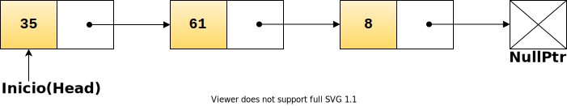

# Listas Enlazadas

<small>Created by
    <a href="https://t.me/rmarku" target="_blank">
        <i class="fab fa-telegram-plane"></i>rmarku
    </a>
</small>

---
# Listas Enlazadas

Las listas enlazadas son una Estructura de datos del grupo de los Contenedores. Permite
guardar datos y poder recuperarlos  más adelante.

---

## Nodo

El nodo es la estructura fundamental de la lista. Este esta formado por dos partes. El dato que se desea guardar y un
puntero al siguiente nodo.

---

## TDA Nodo

Como toda estructura de datos, el nodo consta de datos o atributos y acciones o métodos.

#### Atributos

* `int data;`
  * Puntero al siguiente nodo
* `Node *next;`
  * Puntero al siguiente nodo

---

## TDA Nodo

#### Métodos

<small>

* `int getData()`
  * Devuelve el dato interno al nodo
* `void setData(int d)`            	
  * Cambia el dato interno del nodo          	
* `Node* getNext()`                	
  * Devuelve el puntero al nodo siguiente             	
* `void setNext(Node *n)` 	
  * Remplazar puntero al siguiente nodo      	

</small>

---

## Listas Enlazadas

Una lista enlazada es una estructura de datos en la que cada elemento (**nodo**) tiene dos partes, uno con información
 (un valor de tipo genérico, dato, info,etc.) y el otro con la **dirección** del nodo siguiente.

---

## TDA Lista Enlazada

Como toda estructura de datos, la lista enlazada consta de datos o atributos y acciones o métodos.

#### Atributos

* `Node *inicio;`
  * Puntero al primer nodo de la lista               	

---

## TDA Lista Enlazada

#### Métodos

<small>

* `void insert(int pos, int dato)`
  * Insertar dato a la lista en el lugar pos
* `void remove(int pos)`            	
  * Remover dato a la lista                  	
* `int get(int pos)`                	
  * Obtener dato en la lista                 	
* `void replace(int pos, int dato)` 	
  * Remplazar dato en la lista               	
* `int find(int dato)`              	
  * Buscar un dato en la lista               	
* `bool isEmpty()`                  	
  * Ver si está vacía la lista               	

</small>

---
## Lista Enlazada
## A implementar.
